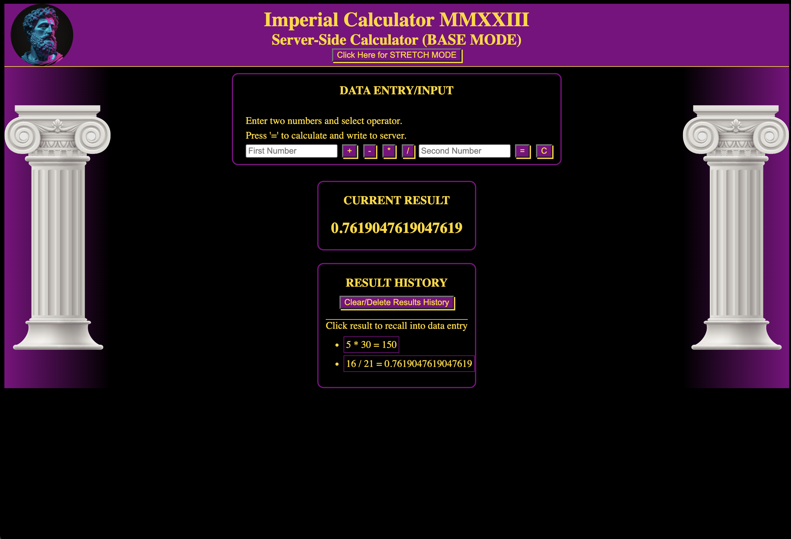
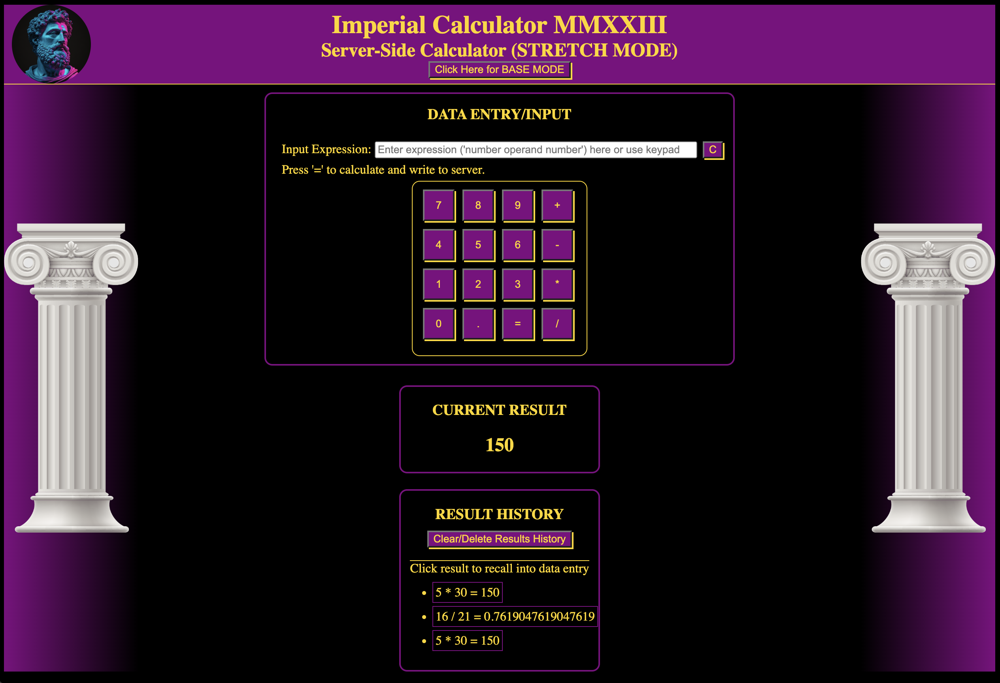

# WEEKEND-SERVER-CALCULATOR
# Imperial Roman Calculator

## Description

<!-- _Duration: 3 days_ -->

This project is a solution to the Prime Digital Academy weekend challenge of the same name. The end product meets all specs for baseline and stretch goals. The code challenge instructions are found [here](./INSTRUCTIONS.md).

Not commonly known was the desire of Roman Emporer Marcus Aurelius, always the philospher, to transition from calculations using Roman Numerals to Arabic Numerals. This simple web app reconstructs his efforts in a structured way. The first sentence in this paragraph is completely made up, but gives me an excuse to do some practice with CSS styling.

To complete this project I used the following checklist to break the problem down into steps.

Base Mode Steps
- [x] Conduct project dependencies install on server side
- [x] Test basic server function (call public assets from browser)
- [x] Create site file structure
- [x] Create basic styling
- [x] Create and test server side GET Route meeting project specs
- [x] Create and test server side POST Route meeting project specs
- [x] Implement client side form handling meeting project specs
- [x] Create client side GET route to handle display of results and results history
- [x] Create client side POST route to handle passing of data to server for calculations
- [x] Implement clear button functionality

Stretch Mode Steps
- [x] Implement server side data validation
- [x] Implement client side data validation
- [x] Implement clear history button functionality
- [x] Update input interface to look like real world calculator
- [x] Implement recall/re-run buttons on calculation history results
- [x] Finalize CSS Styling
 
To achieve the stretch goal of updating data entry to work like a real world calcultor, I used a grid display type in CSS to arrange the keys, then reqrote the CSS and javascript to append the values directly into the iput field. In order to prevent test-mode failure, the stretch goal was implemented by linking to a seperate stretch goal page with it's own stylesheet and client.js. I was also a little disappointed that javascript does not inherently view strings as arrays of characters ( I had originally envisioned data manipulation of strings using array methods, but hey, I figured it out anyway).

The styling of the interface was influenced by an Imperial Roman color and style theme.

## Screen Shot

Base Mode Screen Shot

Stretch Mode Screen Shot

### Prerequisites

- [Node.js](https://nodejs.org/en/)
- [express](https://expressjs.com/)

## Installation
 
1. Open up your editor of choice and run an `npm install`
2. Initiate the server using `node server/server.js`
3. navigate to host ip and port in browser (e.g. `127.0.0.1:5000`)
4. Enjoy!!!

## Usage

1. In base mode
  - Enter numbers into the `First Number` and `Second Number` input fiels of Data Entry / Input area.
  -  Select an `operator` button (only one can be selected at a time). Selected button will stay depressed so you can remember which you selected.
  - Press the `=` button and the result will display to the results areas and the entire expression will be written to the server
  - Press the `C` button to clear the dta entry area without evaluation of expression.  You will have to reselect your operator as well.
  - In the history area, press the `Clear/Delete Results` button to clear the Result History and delete all results from the server.
  - In the history area you may slect one of the `displayed expressions` within it's borders to recall that expression to the data entry area.  This will over-write any input currently in the data entry area.
2. In stretch mode
  - All functionality remains the same except...
  - Instead of filling in the number inputs and selecting operator, you may use the `keypad` or type directly into the `Input Expression ` field.
  - Pressing the `=` button will send the expression to the results area as expected.
3. Mode Switching
  - To switch between `base mode` and `stretch mode` press the mode button in the banner marked `Click here for (BASE/STRETCH) MODE`.

## Built With

1. Server Side
  - Node.js 
  - javascript
  - express
2. Client Side
  - HTML
  - CSS
  - javascript
  - Axios

## Acknowledgement
Thanks to [Prime Digital Academy](www.primeacademy.io) who equipped and helped me to make this application a reality. (Thank your people)
